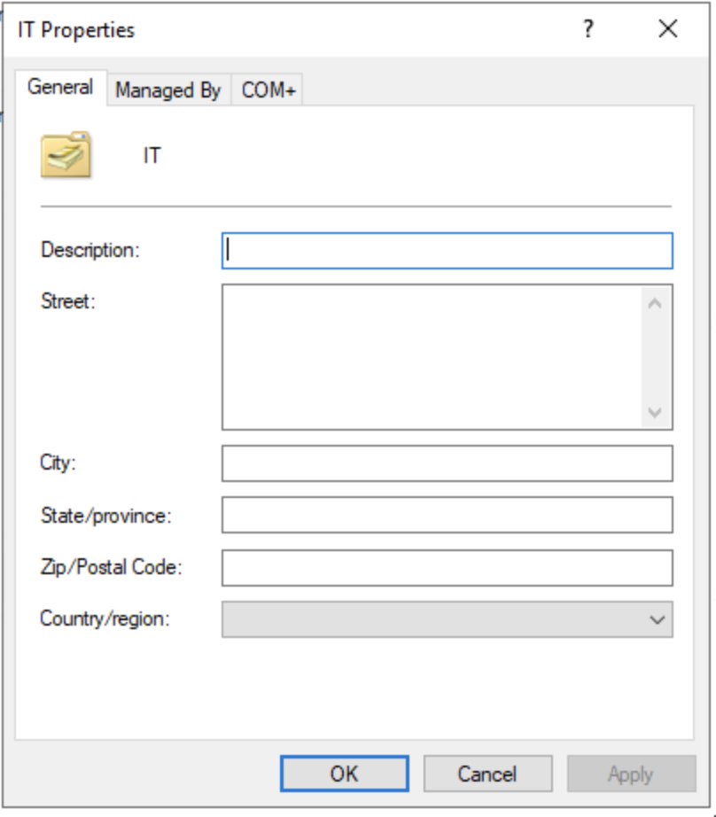
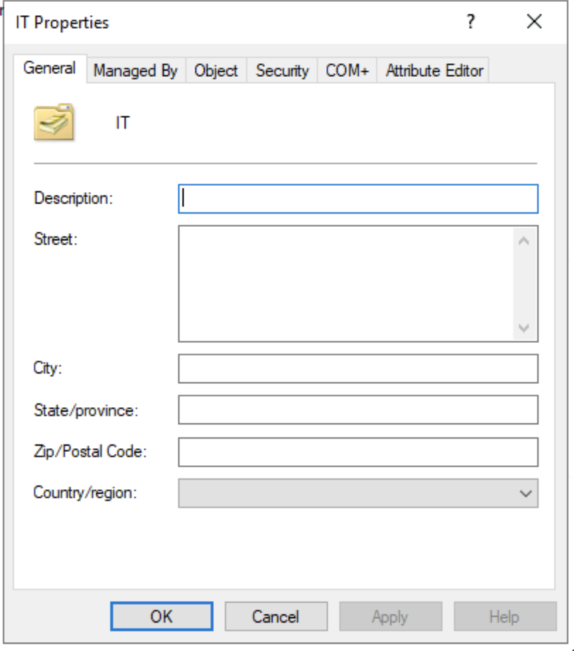
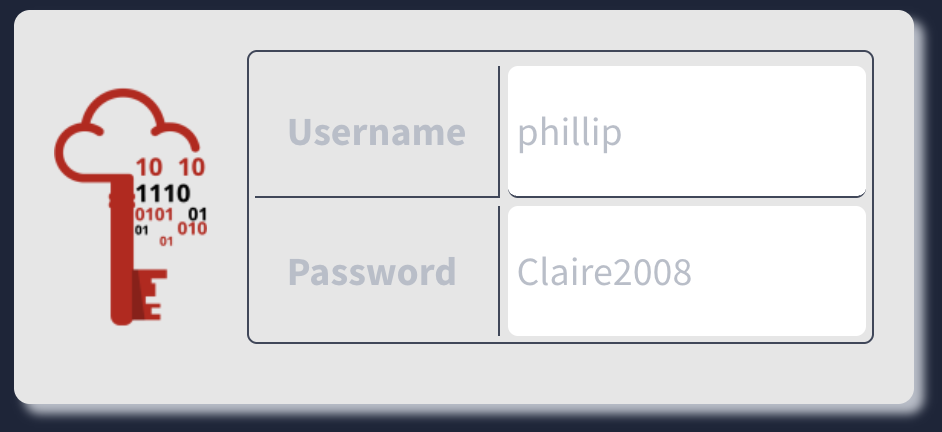
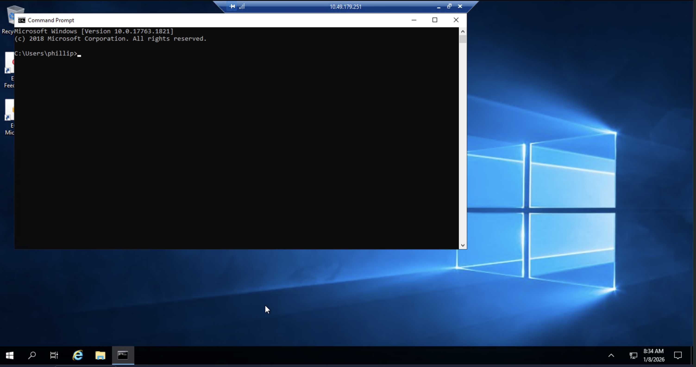
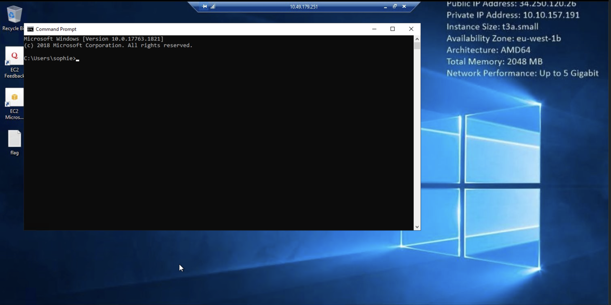
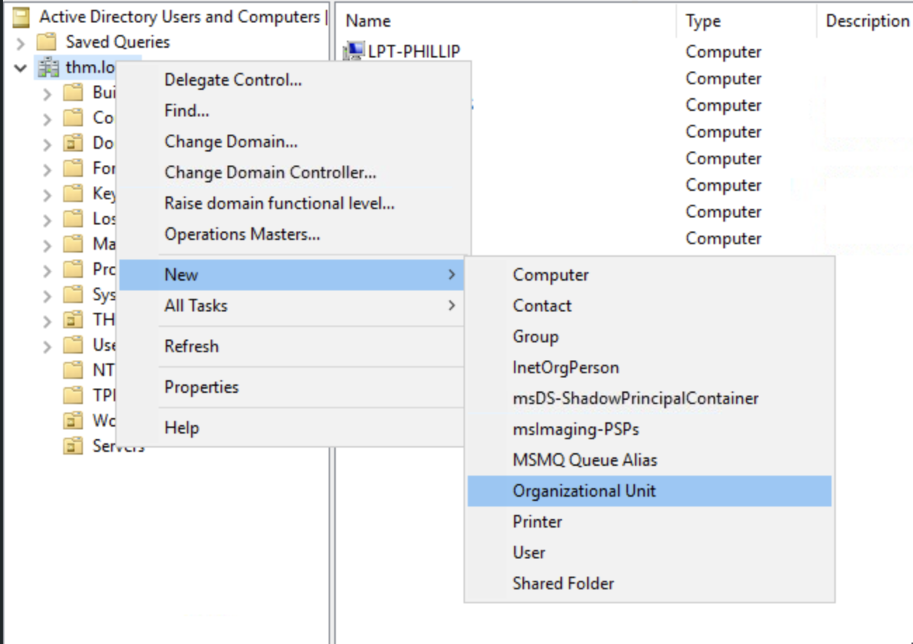
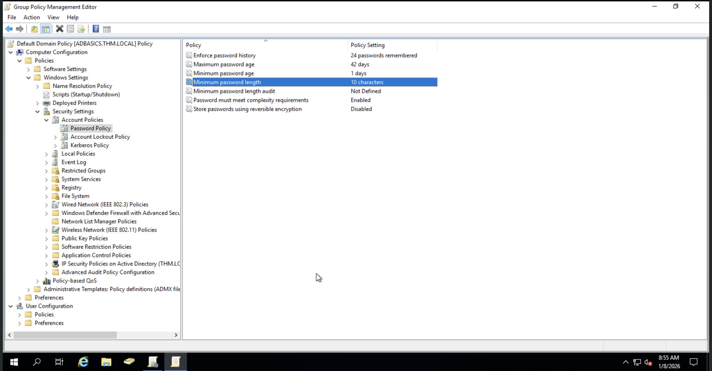
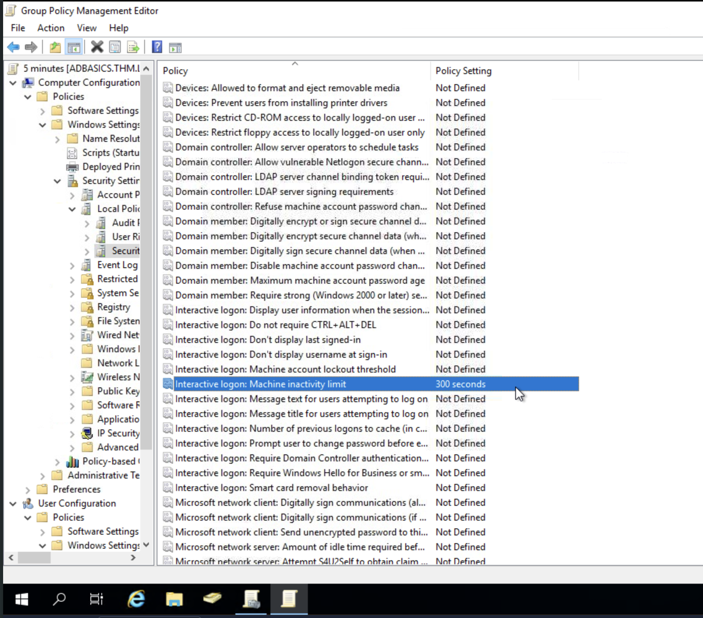
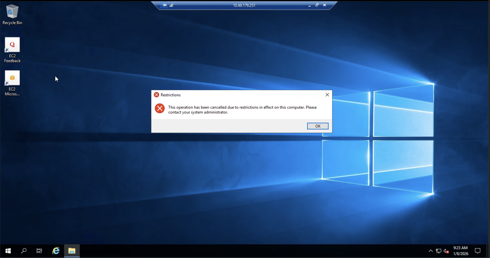
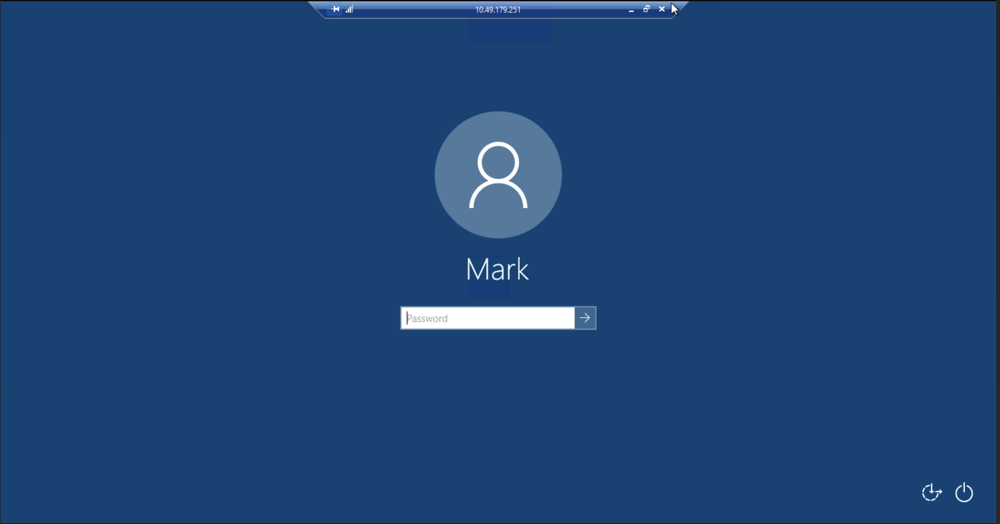

# Windows Fundamentals & Active Directory - Active Directory - TryHackMe Walkthrough

[Active Directory](https://tryhackme.com/room/winadbasics)

## Hands-on Labs with Impact 

#### Task 1: Check AD Users based on Organisational Units (OUs), based on the chart given below:


#### Action: 

Followed the steps from TryHackMe and got stuck where I did not manage to find the accidental deletion option. After reading the steps and navigating through what is written, when I check again, there are more options on the properties in OU after clicking through the view and tick the advanced features option.

Before:



After:



Then, I managed to delete the OUs that are not listed on the chart. Although, I deleted the Management OU by accident.

#### Impact:

Learned the skills of attention to detail by deleting extra OUs in the lab computer provided by TryHackMe.

#### Task 2: Delegate the OU of a specific department to other department.

#### Action: 

Managed to edit the settings for one of the users inside the OU, which is to enable password reset of the other user. After digging through a method on how to login other user, the lab provided Remote Desktop Connection (RDP) to the other IP address. Then, I logged in as Phillip, one of the users in the IT OU. Here are the credentials:





Then, managed to cut the long powershell command that is provided by TryHackMe into this simple command:

```powershell
Set-ADAccountPassword sophie -Reset
```
I managed to login as sophie by running this command:



#### Impact:

Able to set a new permission based on the OU provided in the Active Directory Users and Computers software to protect clients from any accidental clicks or changes.  

#### Task 3: Create OUs that categorises computers and servers.

#### Action: 

Explored how to add a new OU in the Active Directory Users and Computers software:



Created 2 new OUs based on what is instructed, which are computers and servers. Then, I managed to categorise the computers folder into an OU that has been created.

#### Impact:

Able to learn a new skill called Organisation, where the task is to organise computers and servers into separate OU folders to make them more accessible. 

#### Task 4: Change the settings of the Group Policy Object (GPO) of the Default Domain Policy, Change to minimum 10 characters for a password.

#### Action: 

It uses a different software called Group Policy Management (GPM), where the user is able to add, modify, and/or delete GPOs that are listed which connects to the OU itself. On the app, I double clicked on the Default Domain Policy GPO that is listed on the tree directory of the company name (in this case thm.local). With moderate effort, I managed to find the password length policy, which is located on the Computer Configuration settings.



#### Impact: 

Able to modify the GPO that is existed to the needs of the company or user.  

#### Task 5: Create and apply GPOs that:

##### Block non-IT users from accessing Control Panel

#### Action: 

Added a new GPO on the folder called Group Policy Objects that is located on the domain directory. Then, double clicked the new GPO that has been created and read TryHackMe's guide on locating the configuration settings as I got overwhelmed to find the settings that relates with Control Panel. I located and enabled the setting.

##### Make the screen lock 5 minutes without any users interacting.

#### Action: 

The first step is pretty much the same, but the second step is to locate the settings that relates with machine inactivity, also referencing to the guides that is given by TryHackMe.



Not done yet! These steps above are just creating and enabling the settings of the GPO itself, not applying it to the computers. These settings are active when the GPOs are dragged into the other folders located under the domain. 

After that is done, here are the proof that these settings are applied:





#### Impact:

Learned a new skill to add and modify a new GPO in the software called Group Policy Management (GPM) to protect any insider and external threats in the future.

## Skills obtained

#### Hard skills:

- Group Policy Management (GPM)
- Basic Active Directory

#### Soft skills:

- Users Organisation
- Attention to Detail

## Conclusion

This room needs a fundamental knowledge of Windows Operating System as this covers in-depth about manage users and computers access. It is also recommended to explore the settings that the GPO offers as it will be valuable to understand them as it covers a lot of internal settings to configure the company's devices.
