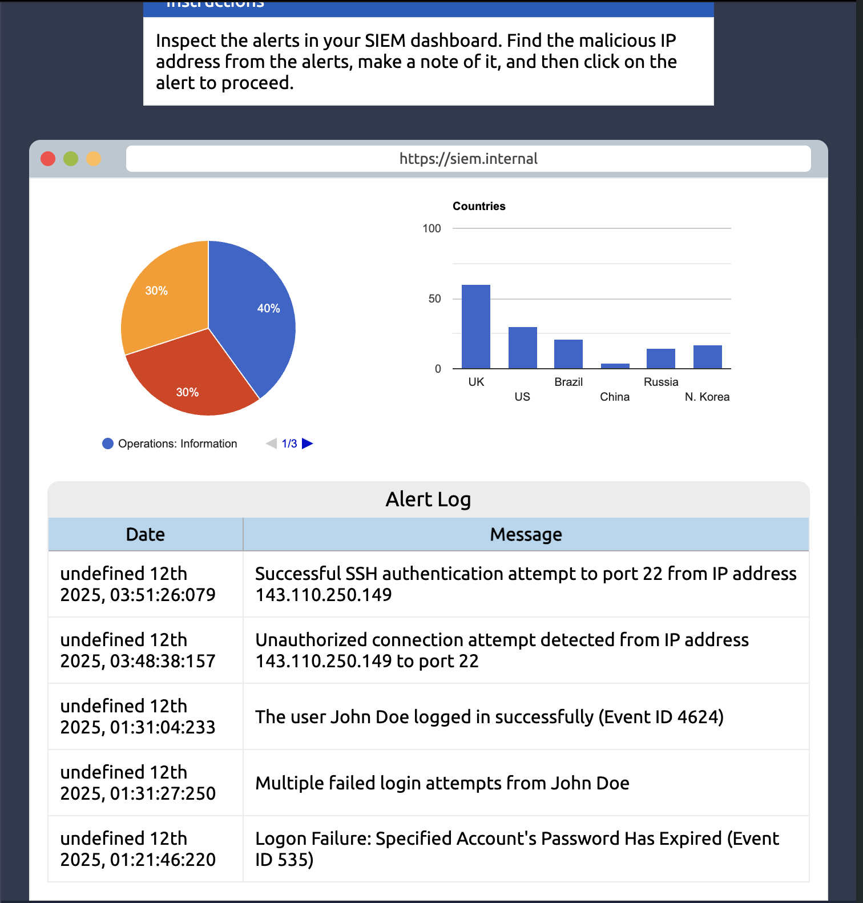
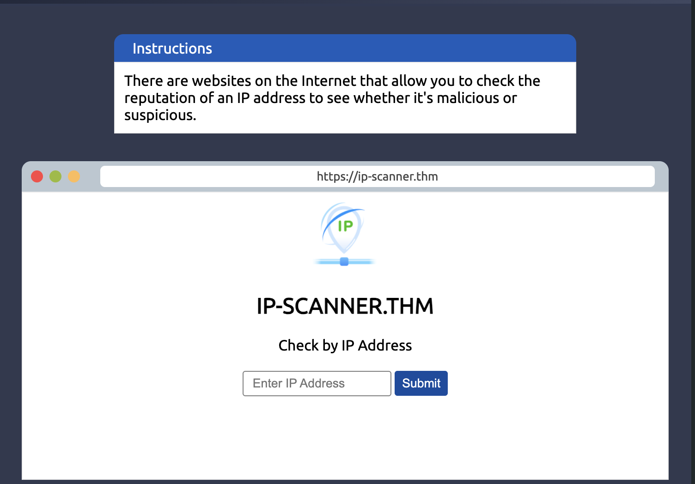
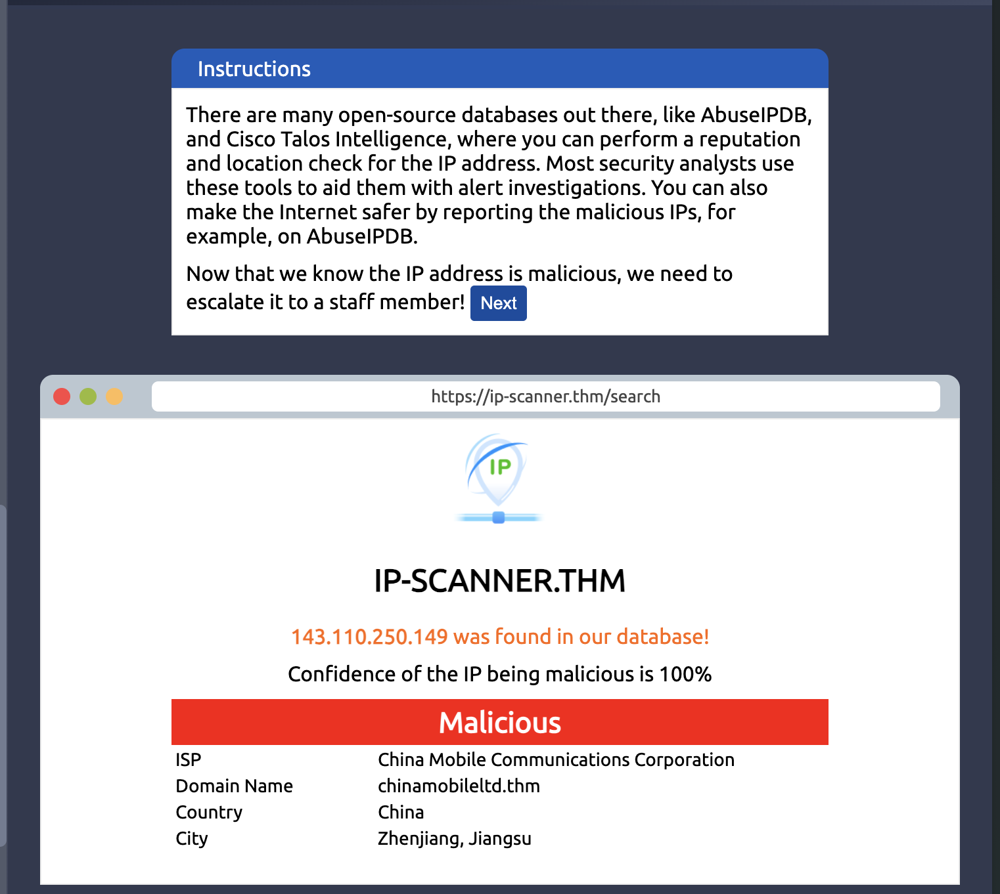
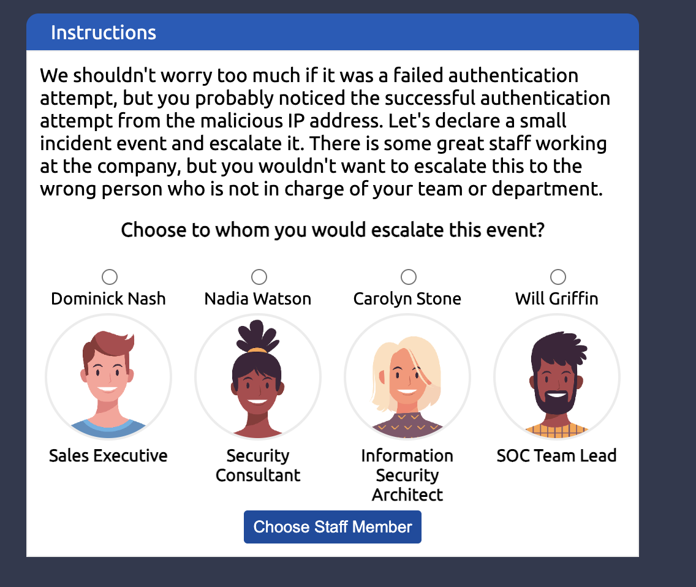
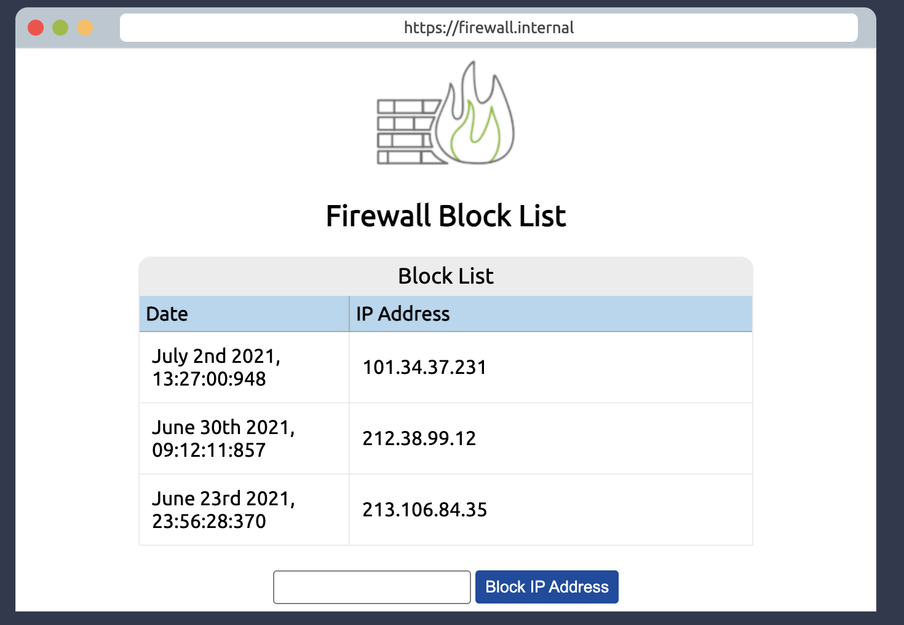
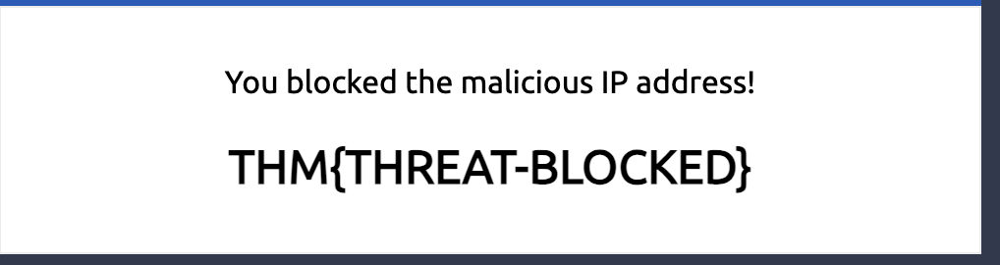

# Defensive Security - Introduction to Cyber Security - TryHackMe Walkthrough

[Room](https://tryhackme.com/room/defensivesecurityintro)

### Objectives of this room:

1. Understand what Defensive Security is and its possible careers
2. Simulate the role of a security analyst

### Table of Contents 

1. **Underlying Concepts**
2. **Hands-on lab process & thoughts**
3. **Discussion**

### Underlying Concepts

Defensive Security is a type of cyber or digital security, in which is the reverse of offensive security, that aims to prevent, detect, and respond to any intrusions to occur inside of a computer application and/or system. There are a number of possible careers inside defensive security, such as ***Security Operation Center (SOC), Threat Intelligence, Digital Forensics and Incident Response (DFIR), Malware Analysis, and Cyber Security Analyst, one of the most popular entry level of cyber security***. This type of digital security contains one of the field that has a lot of job types. These roles are crucial in Cyber Security because they are the ones who safeguards the system. There are a number of different responsibilities that these different roles have done, explained below:
1. **Increasing cyber security awareness** - Train clients about cyber security to protect against attacks targetting their systems.
2. **Documenting and managing assets** - Adequately document, record, manage, and protect any systems and devices of a user/client.
3. **Updating and patching systems** - Making sure that all systems are up to date within the latest version and patched against any known vulnerabilities
4. **Setting up any preventive security devices** - Preventive security devices such as Firewall and IPS (Intrusion Prevention System) need to be setup correctly to protect the network from malicious actors.
5. **Setting up logging and monitoring devices** - To be able to view any unauthorised device in a network, it is crucial for a security analyst to detect and log the activities of the device.
Also, here are a simple and brief explanation of each role mentioned above:
- **Security Operation Center (SOC)** - Monitor network and systems to detect any suspicious cyber security events and/or incidents
- **Threat Intelligence** - Gathers information to help the company prepare against potential risks of a cyber attack.
- **Digital Forensics and Incident Response (DFIR)** - Broken down into these sections:
  - **Digital Forensics** - Analyse any evidence of the cyber attack.
  - **Incident Response** - Reduce the damage caused by the cyber attack and recover it within the shortest time possible, to keep the operation running.
  - **Malware Analysis** - Learn about malicious programs with a number of purposes:
    - **Static Analysis** - Inspect the malicious program without actually running the program itself
    - **Dynamic Analysis** - Running the malicious program in the sandbox environment and monitor the activities.

### Hands-on lab process & thoughts

This lab will be broken down into several images and includes any explanations of the image itself.

#### Thoughts on this step

So, the first step of this lab is to identify the single log that is malicious from the list of logs listed on the alert log. The second log is the ones that is malicious because of the Confidentiality violation. It shows the colours also when you hover into the logs listed. Moving on to the next step!

#### Thoughts on this step

This step is the most crucial. It is important to gather a lot of information about the target first, who is it, where does the target is located, etc. Based on the information given above, the lab provides an IP scanner to gather the information about the target. 

#### Thoughts on this step

This is the step after you have gathered enough information and reported the malicious log. This action will be reported to the SOC Team Lead, which is the person who is responsible for managing the Security Operation Center in the team. 

#### Thoughts on this step

This part makes sure that the threat actor who attempts to logging into the network will be blocked by the connection, using a firewall. I thought this app would show the IP addresses that are not blocked. After 2 failed attempts, I realised that this is a firewall blocker and it shows the list that are blocked, adding the malicious IP address to block it so that it will not happen cause any problems again in the future.

### Discussion

- Which team focuses on defensive security?
    - Blue team
- What would you call a team of cyber security professionals that monitors a network and its systems for malicious events?
    - Security Operation Center (SOC)
- What does DFIR stand for?
    - Digital Forensics and Incident Response
- Which kind of malware requires the user to pay money to regain access to their files?
    - Ransomware, from the word ransom, which defines as the sum of the money that is demanded.
- What is the flag that you obtained by following along?

