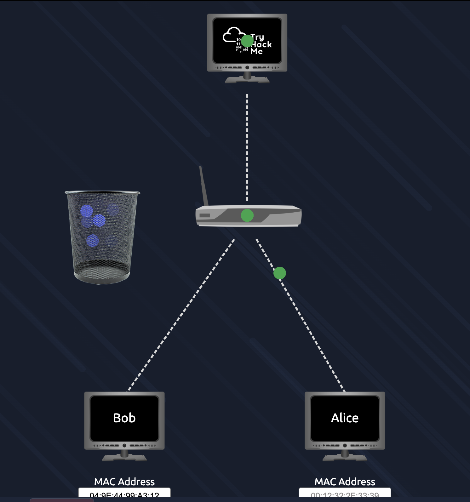
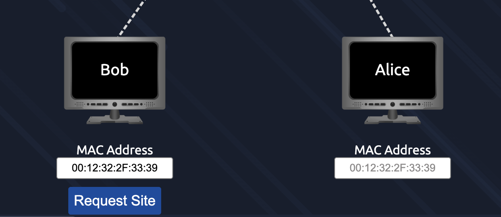
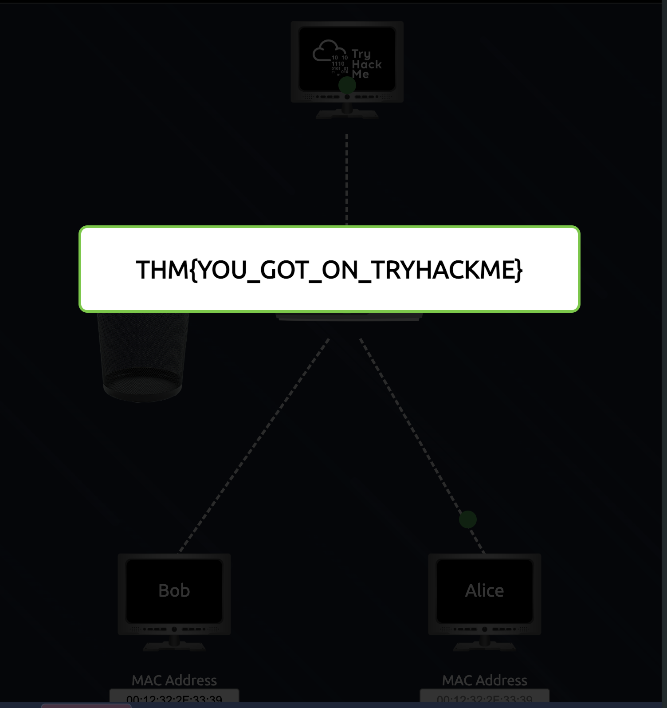
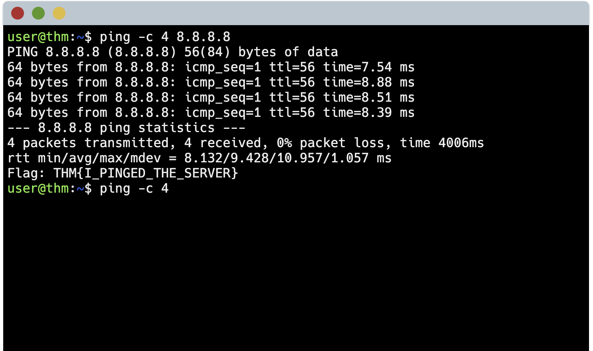

# Network Fundamentals - What is Networking? - TryHackMe Walkthrough

[Room Link](https://tryhackme.com/room/whatisnetworking)

## Objectives of this room

1. Understand the networking definitions in digital scope 
2. Understand and implement MAC Spoofing technique
3. Comprehend how pinging works

## Table of Contents

1. Underlying concepts
2. Hands-on Labs and tools used (The Process)
3. Thoughts

## Underlying Concepts

A network is defined as an array of digital devices connected to each other. Example: a phone or laptop that is connected to a router. Devices can be vary, not only laptops or phones, but home appliances are also considered networking devices, starting from light bulbs, toilets, fridges, etc., that can be connected to other devices.

Alongside with network, we have an internet, which is defined as a collection of small networks that are connected within each other that forms into a single giant network of communication. **Example**: A phone has a web browser to browse the internet, let's say Google for this instance. This phone needs a networking device called the router to be able to forward its IP address to Google's server. Usually, smaller networks such as home internet or small company can be considered as a private network, while the connection between these smaller networks are considered as a public network, which forms the internet. Devices need to be identified, like ourselves, we identify them by name. Devices are identified using IP (Internet Protocol) address and a MAC (Media Access Control) address.

IP Address is an address that is used for identifying a host on a network for some period of time, which can refer to another device without changing it. They can change from one device to another, but they cannot be active at the same time more than once inside the same network. For instance, if I have an iPhone with an IP Address of `192.168.0.1`, then my other device, which is a PC, cannot have the same IP Address with my iPhone in the same network. If their network connectivity are different, they could share the same IP Address. MAC Address, which is related with IP Address, is a network interface that is installed on the motherboard of the device that is utilised for assigning a unique address of the device. The format is defined as a 12-character hexadecimal number that is split into two numbers separated with a colon, which is called separators. Example of a MAC Address is `a1:b2:c3:d4:e5:f6`. The first 6 character identifies the vendor who builts the network interface, while the last 6 identifies the unique address of the network interface itself.

## Hands-on Labs and tools used (The Process)

### MAC Spoofing concept

#### Scenario: 

There are 2 devices, named Alice and Bob, that is connected to a WiFi network. Each of the devices must have a license or proof of purchase to access the network. One of the devices, which is Bob, cannot have access because it has not had the proof of purchase in it. 

#### Task:

Make Bob grant access to the WiFi network without any license involved. 

#### Action: 

Change Bob's MAC Address into Alice's MAC Address that has it. The network will identify Bob as Alice. 

#### Result:

Bob's packet data is no longer sent to the bin because the network is identifying Bob as Alice, who has paid for the network.

### Ping a network

#### Scenario (Made up with my own thoughts):

A user uses a computer to browse the internet. He wants to make sure that the website or IP Address that he visited is up and running smoothly. 

#### Task:

Ensure that the host is running later while visiting.

#### Action:

Use the command `ping` in the terminal, up to 4 times by running the command in the terminal: `ping -c 4 <IP Address or website> `. 

#### Result: 

The average time for the server to receive the request from the device is 9.428 milliseconds. 

## Thoughts

I think this room is a fundamental concept on how networking works in a simple form. It introduces the broad concept of networking as well as some addresses inside the devices, such as IP Address and MAC Address. On the hands-on lab section, I learned mostly on how to perform a MAC Spoofing as well as how to ping a server to check if the web server is receiving any packets in any form of devices. 
