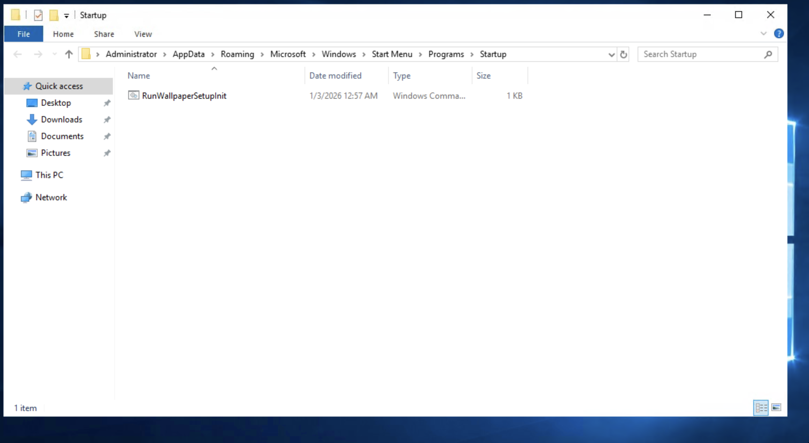
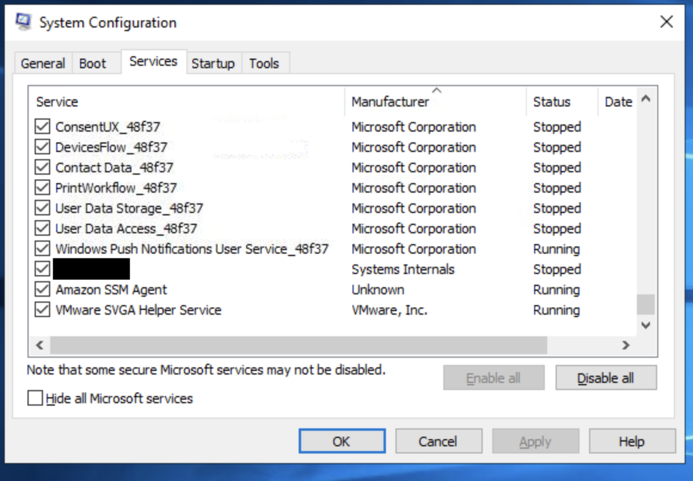
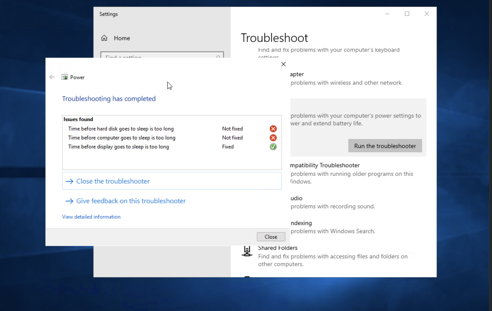
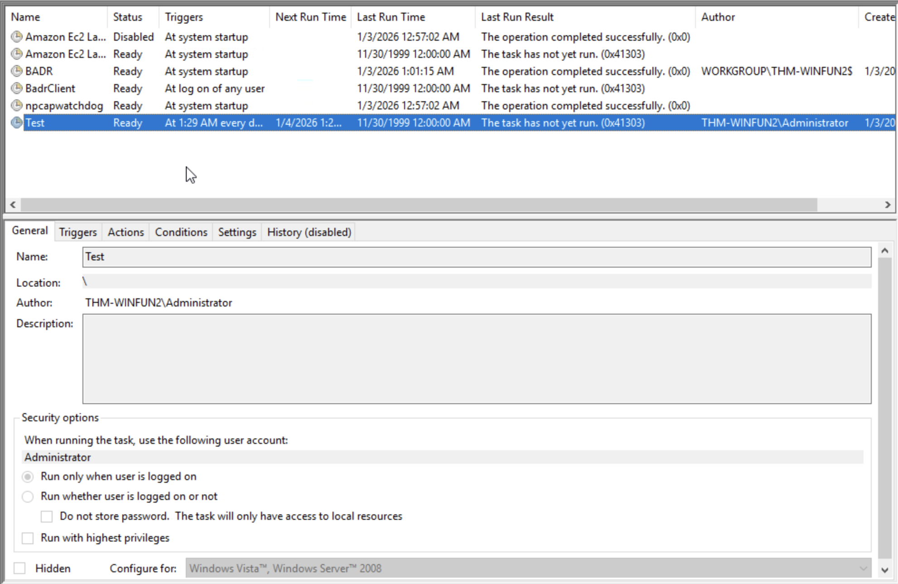
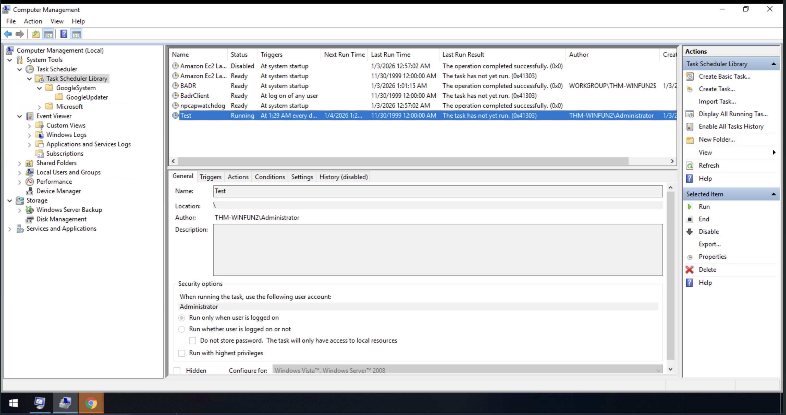
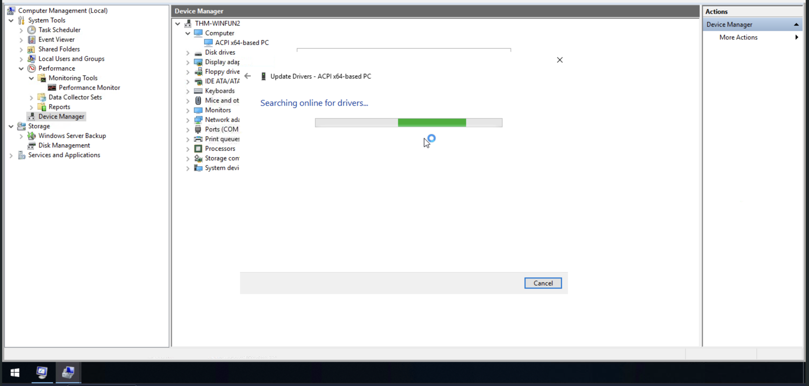
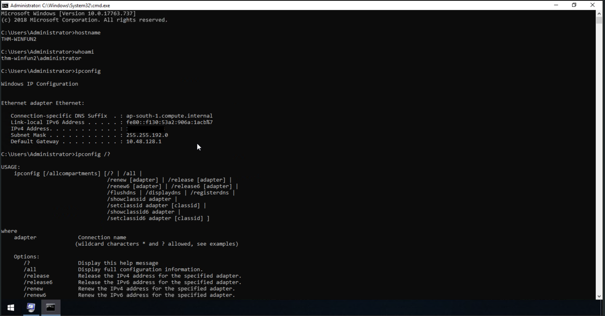

# Windows Fundamentals - Part 2 - TryHackMe Walkthrough

[Room Link](https://tryhackme.com/room/windowsfundamentals2x0x)

## Executive Summary

This room covers about a range of administrative tasks inside the Windows Operating System. Starting from the Command Line, System Configuration app as well as its tools, and Advanced System Settings to set any permissions of the new system.

## Key Concepts

- System Configuration - The Application installed inside the Windows OS that views the system performance and launches tools that are listed.
- Command Line - The Application installed on the Windows OS to interact commands that modifies the system.
- Task Scheduler - A tool that is utilised for automating tasks, such as opening a specific app within a specific time frame.
- Advanced System Settings - The Application in Windows that allows the administrator to perform advanced modification on the system settings.
- Startup - The folder that contains a file which Windows is utilising after booting up.
- Performance Monitor - The Windows app that tells how much memory is utilised inside the system.

## Hands-on Activity with explanations

#### Explore the startup folder in Windows

This folder contains one or more system files that are utilised after booting up the machine. The startup folder can be accessed by pressing `Win + R` or opening an application called `run` then type `shell:startup` to open the startup folder. This allows the user or client to determine what applications are running after booting up the system. 

This application provides some sections that are important, such as enabling certain services, configuring the options on how to start the machine, as well as different range of critical tools that may change the overall system performance. That is why this access is limited to accounts that has administrative access, such as System or Administrative accounts. 

The answer is listed on the tools section, where there is the application's path that is displayed below the list, above the launch button. 

I tried to launch one of the tools that is not listed on the TryHackMe's official tutorial, so I was exploring this by myself. One of the tools is the troubleshooter. This application provides a general solution on how to fix a common problem that appears on the Windows Operating System. Problems are vary, starting from configuring WiFi to Connecting a Bluetooth and Printer to the device.

I also tried to add a task in the Task viewer listed on one of System Configuration tools called Computer management. The appliction allows the user to run certain programs that he or she wants to run at a specific time. On the image above, it shows that the application called Google Chrome will run at 01:29 every day. 

Here is the image after running the program. It opens the application without the interaction from the user to open Google Chrome. So, it automates any programs and/or scripts. 

One of the tools that a computer management app has is Device Manager. It features a number of different hardwares that is installed in the device itself. Tried out of the scope, I tried to update the Computer driver by navigating through the properties and click the drivers section. On there, I click update drivers. It just took a long time searching for online drivers, as this machine does not connect to the internet.

Similar with UNIX Operating Systems, Windows Operating System also has a built-in command line. The language that Windows utilise is different from with UNIX. They share some similarities, such as `ipconfig` is a command run on Windows to check the IP address while on linux or UNIX the command is `ifconfig`. The difference lies on the language, where Windows utilised the mix of C and C++ while UNIX or linux uses bash scripting language. 

## Reflection

- What new things do I learn from the room?

I learned how to discover the System Configuration application and Advanced System Settings on the Windows Operating System, as well with its tools and the Command Line of the Operating System itself.

- How do I apply these concepts in the real world?

The command line may be valuable to solve certain tasks, such as deleting a file or creating a directory. The GUI offers accessibility on clicking certain things, while the command line completely doing it directly. For instance, if you delete a file or a folder using the GUI, then it goes on to the trash, while if you use a command line, it will be permanently deleted without going to the trash. 

For the Advanced System Settings and System Configuration, it is valuable when doing certain administrative tasks, such as deleting a log file every week or month to keep the hard disk stable, creating new users or groups for new employees, and many more. These settings are valuable when a user needs to perform an administrative task which is mentioned on the example above. 
